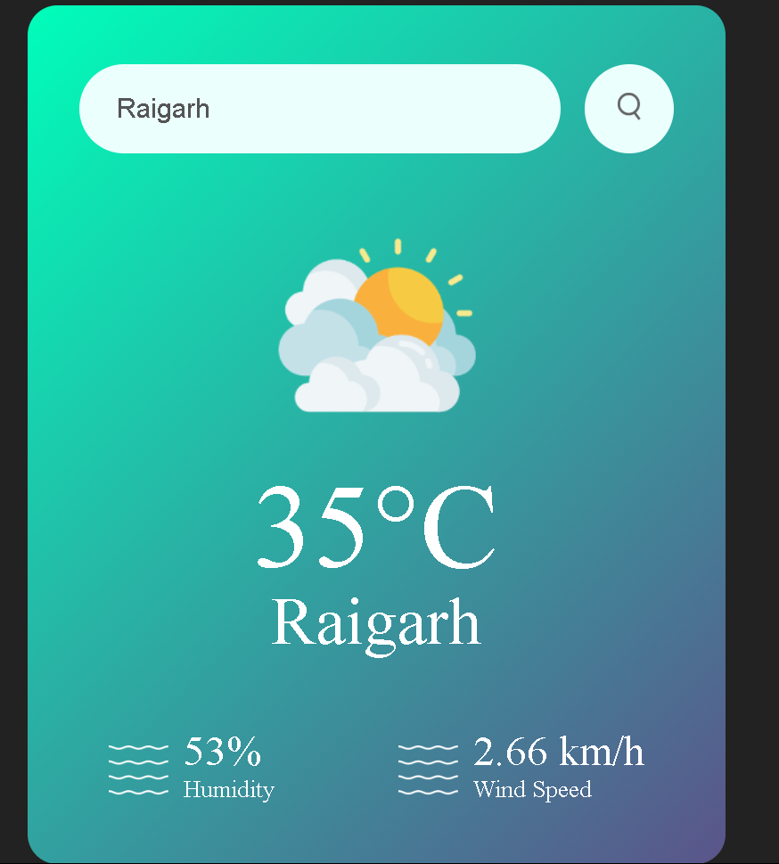

# ⛅ Weather App

A simple, clean **Weather App** built using **HTML**, **CSS**, and **JavaScript**, which fetches real-time weather data using a public Weather API.

Check the weather for any city in seconds!

---

## 🚀 Live Demo

👉 [View Live](#) *(Add your deployed link here — e.g. GitHub Pages, Netlify, or Vercel)*

---

## 📌 Features

- ✅ Get current weather information by city name.
- 🌡️ Shows temperature, weather description, humidity, and wind speed.
- 📍 Clean, responsive design.
- 🌍 Fetches real-time data using a Weather API (e.g., OpenWeatherMap).
- 🔄 Refresh or search for different cities instantly.

---

## 🛠️ Technologies Used

- **HTML5**
- **CSS3**
- **Vanilla JavaScript**
- **Weather API** (e.g., [OpenWeatherMap](https://openweathermap.org/))

---

## 📂 Project Structure
```
Weather-App/
├── index.html
├── style.css
├── script.js
└── README.md
```

---

## ▶️ How to Use

1️⃣ **Clone the Repository**

```bash
git clone https://github.com/NikhilPatel003/Weather-App.git
cd Weather-App
```

2️⃣ Open in Browser
- Double-click index.html
- OR

-Open the folder in VS Code, install the Live Server extension, and click Open with Live Server for a live preview.

3️⃣ Search for Weather
- Enter the name of a city in the search box.

- Click the Search button.

- View real-time weather data.

---

## 🔑 API Configuration

> ⚠️ **Make sure you add your own API key!**

1. Sign up at [OpenWeatherMap](https://openweathermap.org/api) (or your preferred weather API) and get your API key.

2. In `script.js`, replace:

   ```javascript
   const API_KEY = 'YOUR_API_KEY_HERE';
   ```
   with your actual API key.
## 📸 Screenshots
 


---

## 📑 License

This project is open source and free to use for learning purposes.

---

## 🙌 Author

**Your Name**  
[GitHub](https://github.com/yourusername) | [LinkedIn](https://linkedin.com/in/yourusername)

---

Happy Coding! 🎉
